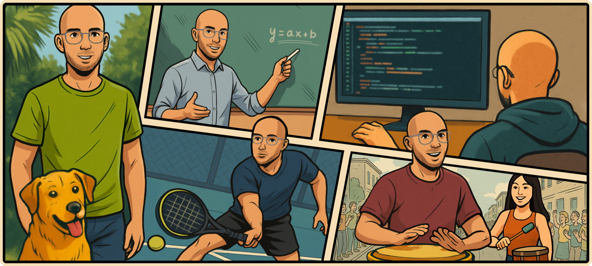

<h3 align="center">
    
</h4>

<h4 align="center">

</h3>

◈ Master student of Data Science and Engineering at [Técnico Lisboa]. Developing my Master's Thesis in Open-ended Named Entity Recognition, partnering with NeuralShift.

◈ Perfecting how to build & deploy AI with impact. Currently following some online courses on ML Engineering.

◈ Freelancing web & mobile development projects. Adventuring into web & graphic design.

◈ Experienced .NET software developer. Co-founded a spinoff software company. Consulted on several projects and managed a small team of developers.

See references and contributions for this README.md file [here](ref.md).